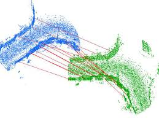

<div id="top"></div>
<!--
*** Thanks for checking out the Best-README-Template. If you have a suggestion
*** that would make this better, please fork the repo and create a pull request
*** or simply open an issue with the tag "enhancement".
*** Don't forget to give the project a star!
*** Thanks again! Now go create something AMAZING! :D
-->


<!-- PROJECT SHIELDS -->
<!--
*** I'm using markdown "reference style" links for readability.
*** Reference links are enclosed in brackets [ ] instead of parentheses ( ).
*** See the bottom of this document for the declaration of the reference variables
*** for contributors-url, forks-url, etc. This is an optional, concise syntax you may use.
*** https://www.markdownguide.org/basic-syntax/#reference-style-links
-->
[![Contributors][contributors-shield]][contributors-url]
[![Forks][forks-shield]][forks-url]
[![Stargazers][stars-shield]][stars-url]
[![Issues][issues-shield]][issues-url]
[![MIT License][license-shield]][license-url]
[![LinkedIn][linkedin-shield]][linkedin-url]


<!-- PROJECT LOGO -->
<br />
<div align="center">
  <a href="https://github.com/abwerby/Point-CLouds-Matching">
    
  </a>

<h3 align="center">Point CLouds Matching</h3>

  <p align="center">
    Point clouds matching with global and local registration methods
    <br />
    <a href="https://github.com/abwerby/Point-CLouds-Matching"><strong>Explore the docs »</strong></a>
    <br />
    <br />
  </p>
</div>


<!-- TABLE OF CONTENTS -->
<details>
  <summary>Table of Contents</summary>
  <ol>
    <li>
      <a href="#about-the-project">About The Project</a>
      <ul>
        <li><a href="#built-with">Built With</a></li>
      </ul>
    </li>
    <li>
      <a href="#getting-started">Getting Started</a>
      <ul>
        <li><a href="#prerequisites">Prerequisites</a></li>
        <li><a href="#installation">Installation</a></li>
      </ul>
    </li>
    <li><a href="#contact">Contact</a></li>
  </ol>
</details>


<!-- ABOUT THE PROJECT -->
## About The Project

[![Product Name Screen Shot][product-screenshot]](https://example.com)


<p align="right">(<a href="#top">back to top</a>)</p>


### Built With

* [![NumPy]][NumPy-url]
* [![Open3D][Open3D.js]][Open3D-url]


<p align="right">(<a href="#top">back to top</a>)</p>


<!-- GETTING STARTED -->
## Getting Started

You only need open3d library and numpy to get things working.

### Prerequisites

This is an example of how to list things you need to use the software and how to install them.
* NumPy
  ```sh
  pip install numpy
  ```
* Open3D
  ```sh
  pip install open3d
  ```

### Installation

1. Clone the repo
   ```sh
   git clone https://github.com/abwerby/Point-CLouds-Matching.git
   ```
2. Install Open3D packages
   ```sh
    pip install open3d
   ```
3. Load your srouce and target point clouds in prepare_dataset function
   ```sh
    def prepare_dataset(voxel_size):
      print(":: Load two point clouds and disturb initial pose.")
      demo_icp_pcds = o3d.data.DemoICPPointClouds()
      source = o3d.io.read_point_cloud(demo_icp_pcds.paths[0])
      target = o3d.io.read_point_cloud(demo_icp_pcds.paths[1])
      trans_init = np.asarray([[0.0, 0.0, 1.0, 0.0], [1.0, 0.0, 0.0, 0.0],
                              [0.0, 1.0, 0.0, 0.0], [0.0, 0.0, 0.0, 1.0]])
      source.transform(trans_init)
      draw_registration_result(source, target, np.identity(4))

      source_down, source_fpfh = preprocess_point_cloud(source, voxel_size)
      target_down, target_fpfh = preprocess_point_cloud(target, voxel_size)
      return source, target, source_down, target_down, source_fpfh, target_fpfh
   ```

<p align="right">(<a href="#top">back to top</a>)</p>


<!-- USAGE EXAMPLES -->
## Usage

Use this space to show useful examples of how a project can be used. Additional screenshots, code examples and demos work well in this space. You may also link to more resources.

_For more examples, please refer to the [Documentation](https://example.com)_

<p align="right">(<a href="#top">back to top</a>)</p>


<!-- CONTACT -->
## Contact

Your Name - [@twitter_handle](https://twitter.com/abwerby) - abdelrhmanwerby@gmail.com

Project Link: [https://github.com/abwerby/Point-CLouds-Matching](https://github.com/abwerby/Point-CLouds-Matching)

<p align="right">(<a href="#top">back to top</a>)</p>


<!-- MARKDOWN LINKS & IMAGES -->
<!-- https://www.markdownguide.org/basic-syntax/#reference-style-links -->
[contributors-shield]: https://img.shields.io/github/contributors/abwerby/Point-CLouds-Matching.svg?style=for-the-badge
[contributors-url]: https://github.com/abwerby/Point-CLouds-Matching/graphs/contributors
[forks-shield]: https://img.shields.io/github/forks/abwerby/Point-CLouds-Matching.svg?style=for-the-badge
[forks-url]: https://github.com/abwerby/Point-CLouds-Matching/network/members
[stars-shield]: https://img.shields.io/github/stars/abwerby/Point-CLouds-Matching.svg?style=for-the-badge
[stars-url]: https://github.com/abwerby/Point-CLouds-Matching/stargazers
[issues-shield]: https://img.shields.io/github/issues/abwerby/Point-CLouds-Matching.svg?style=for-the-badge
[issues-url]: https://github.com/abwerby/Point-CLouds-Matching/issues
[license-shield]: https://img.shields.io/github/license/abwerby/Point-CLouds-Matching.svg?style=for-the-badge
[license-url]: https://github.com/abwerby/Point-CLouds-Matching/blob/master/LICENSE.txt
[linkedin-shield]: https://img.shields.io/badge/-LinkedIn-black.svg?style=for-the-badge&logo=linkedin&colorB=555
[linkedin-url]: https://linkedin.com/in/abdelrhman-werby-b06a671ab
[product-screenshot]: images/local_registration.png
[NumPy-url]: https://numpy.org/
[Open3D-url]: http://www.open3d.org/docs/release/index.html#
[Open3D.js]: http://www.open3d.org/docs/release/_images/open3d_logo_horizontal.png
